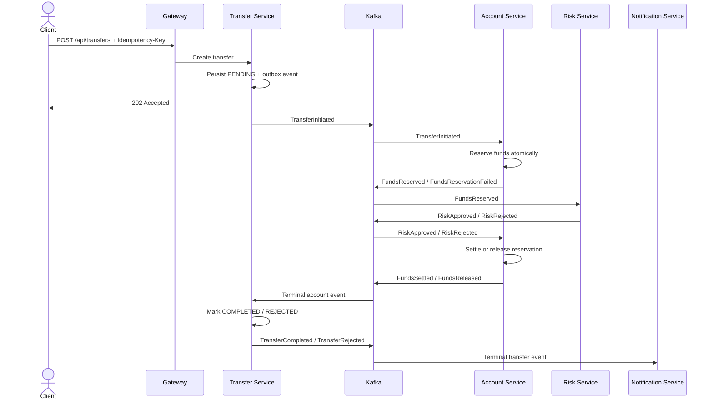

# LedgerFlow

LedgerFlow is a production-style digital banking transaction platform built to demonstrate modern Java backend engineering, resilient microservices, asynchronous messaging, distributed caching, observability, and full-stack integration.

> **Portfolio scope:** LedgerFlow is an educational system. It does not process real money and is not intended for production banking use.

## What the platform will do

A user will be able to:

- create and view bank accounts;
- view available and reserved balances;
- initiate an account-to-account transfer with an idempotency key;
- follow the transfer through validation, funds reservation, risk assessment, settlement, rejection, or compensation;
- inspect operational logs and transfer history through an operations console.

The backend will execute the transfer as a resilient distributed workflow using Kafka events, transactional outboxes, idempotent consumers, PostgreSQL persistence, and Redis-backed request protection.

## What this project demonstrates

- Java 21 and Spring Boot 4.1 application development;
- domain-driven service boundaries and clean architecture;
- Spring Data JPA/Hibernate and PostgreSQL transaction handling;
- Kafka-based asynchronous communication and event versioning;
- Redis idempotency, rate limiting, and short-lived caching;
- optimistic locking, duplicate-message handling, retries, dead-letter topics, and compensation;
- JSON structured logging and Elastic Stack observability;
- unit, integration, contract, and end-to-end testing with Testcontainers;
- React-based operational UI integration;
- Docker Compose local infrastructure and GitHub Actions continuous integration.

## Planned services

| Service | Responsibility |
| --- | --- |
| `api-gateway` | Edge routing, authentication enforcement, correlation IDs, and rate limiting |
| `account-service` | Accounts, immutable ledger entries, balance reservations, and settlement |
| `transfer-service` | Transfer lifecycle, saga coordination, idempotency, and status APIs |
| `risk-service` | Deterministic risk rules and transfer approval decisions |
| `notification-service` | Terminal transfer notifications and delivery audit |
| `operations-console` | React UI for account, transfer, and operational visibility |

## Core transfer flow

## Documentation

- [System design](docs/architecture/system-design.md)
- [Quality attributes](docs/architecture/quality-attributes.md)
- [Event model](docs/architecture/event-model.md)
- [Testing strategy](docs/architecture/testing-strategy.md)
- [Security model](docs/architecture/security.md)
- [Delivery roadmap](docs/architecture/roadmap.md)
- [Technology decisions](docs/technology-stack.md)
- [Architecture Decision Records](docs/adr/)

## Repository status

The repository is being built incrementally. Every delivery stage must include automated tests, documentation updates, and a focused commit.
