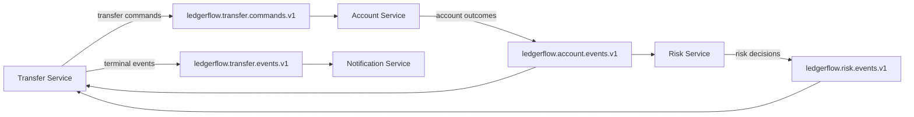
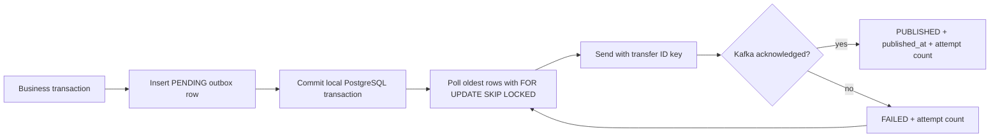

# Event Model

The source-of-truth message contract is
[`contracts/asyncapi/ledgerflow-events.yaml`](../../contracts/asyncapi/ledgerflow-events.yaml).
Only the events listed there are operational in Phase 3.

## Stable envelope

```json
{
  "eventId": "11111111-1111-4111-8111-111111111111",
  "eventType": "ledgerflow.account.funds-reserved.v1",
  "eventVersion": 1,
  "occurredAt": "2026-07-23T12:00:00Z",
  "correlationId": "demo-correlation",
  "causationId": "00000000-0000-4000-8000-000000000000",
  "producer": "account-service",
  "payload": {}
}
```

`eventId` is a globally unique UUID and remains unchanged when publication is
retried. `correlationId` remains constant for the workflow; `causationId` names the
request or event that produced the next event. Times are UTC, UUIDs and money are
JSON strings, and `eventVersion` is positive. Consumers accept unknown optional
fields but reject malformed required fields and unsupported versions.

## Topic ownership



| Topic | Producer | Consumers | Events |
| --- | --- | --- | --- |
| `ledgerflow.transfer.commands.v1` | Transfer | Account | initiated, settlement-requested, compensation-requested |
| `ledgerflow.account.events.v1` | Account | Transfer, Risk | funds-reserved, reservation-rejected, transfer-settled, funds-released |
| `ledgerflow.risk.events.v1` | Risk | Transfer | approved, rejected |
| `ledgerflow.transfer.events.v1` | Transfer | Notification | completed, rejected |

The record key is always the transfer UUID. Kafka therefore orders records for one
transfer partition while different transfers can execute concurrently. LedgerFlow
does not claim global ordering.

Each normal topic has a matching `.dlt.v1` topic. Malformed envelopes, unsupported
versions, unknown event types, and exhausted technical failures are recoverable to
DLT with original topic/partition/offset and exception headers. Expected business
outcomes—including insufficient funds, missing accounts, currency mismatch, and
risk rejection—produce normal events and never enter the retry/DLT path.

## Delivery and duplicates

Delivery is at least once. Every consumer inserts `eventId` into its own
`processed_events` table in the same PostgreSQL transaction as business changes and
any outbound event. A redelivery that already exists returns successfully without
moving money, adding history, deciding risk, or notifying again. Stale but valid
workflow events are recorded as processed and ignored; they cannot reopen a
terminal transfer.

Technical failures use two retries after the initial attempt with exponential
backoff: 1 second, 2 seconds, bounded at 4 seconds. Publication failures leave the
same outbox event retryable.

## Transactional outbox lifecycle



Outbox records are never deleted in Phase 3. The bounded publisher batch and poll
interval are configurable per service. PostgreSQL is authoritative; no in-memory
queue substitutes for the outbox.
