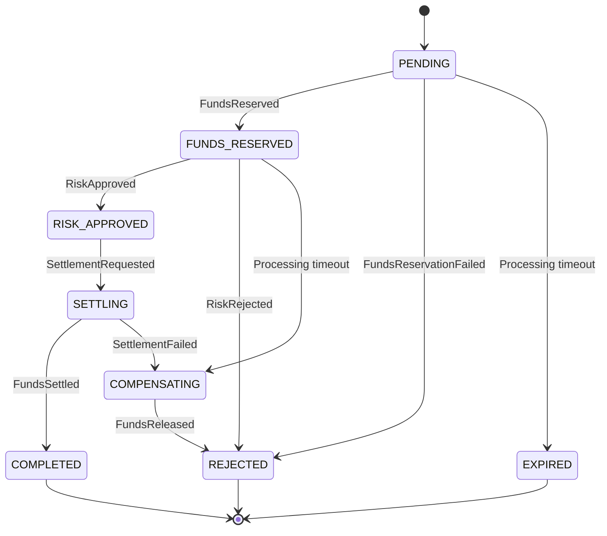

# System Design

## 1. Purpose

LedgerFlow demonstrates how to design and implement a resilient money-transfer workflow across independently deployable Java microservices. The project prioritizes correctness, traceability, failure recovery, and explainable engineering decisions over feature volume.

The repository has completed its foundation and Account Service core phases. Account creation, account reads, immutable credit-ledger history, reconciliation, PostgreSQL persistence, and local/test synthetic funding are operational. Transfer workflows and every other infrastructure integration described below remain planned unless explicitly marked implemented.

## 2. Scope

### In scope

- single-currency account-to-account transfers;
- account creation and test funding;
- available and reserved balance tracking;
- immutable ledger entries;
- asynchronous transfer processing;
- deterministic risk assessment;
- transfer status and history APIs;
- operational notifications;
- centralized logs and dashboards;
- automated tests and local containerized infrastructure.

### Out of scope for the first production-style release

- real payment networks, cards, SEPA, SWIFT, or external bank connectivity;
- interest, fees, foreign exchange, loans, or chargebacks;
- personally identifiable production data;
- multi-region deployment and regulatory certification;
- real email or SMS delivery.

## 3. Service boundaries

### API Gateway

Responsibilities:

- route public API requests;
- validate JWTs when security is enabled;
- propagate `X-Correlation-Id`;
- enforce request size and rate limits;
- expose no business persistence.

### Account Service

Responsibilities:

- own accounts, ledger entries, and materialized available/reserved balances (implemented);
- create and retrieve single-currency accounts (implemented);
- append synthetic local/test credits atomically with balance updates (implemented);
- reject duplicate funding references and unsafe mutations (implemented);
- reconcile signed ledger entries with materialized balances (implemented);
- reserve, settle, and release funds for transfers (planned).

Key invariant:

```text
available_balance >= 0
reserved_balance >= 0
sum(credits) - sum(debits) = available_balance + reserved_balance
```

### Transfer Service

Responsibilities:

- accept transfer requests;
- enforce API idempotency;
- own transfer lifecycle state;
- publish transfer commands through a transactional outbox;
- consume account and risk outcomes idempotently;
- expose transfer status and history.

### Risk Service

Responsibilities:

- evaluate deterministic rules such as amount thresholds, account velocity, and blocked accounts;
- publish an explainable approval or rejection decision;
- keep rules deterministic so tests can fully cover outcomes.

### Notification Service

Responsibilities:

- consume completed and rejected transfer events;
- create an auditable notification record;
- simulate delivery without external vendor dependencies;
- prevent duplicate delivery.

## 4. Data ownership

Each service owns a separate PostgreSQL database or schema and may not directly query another service's tables. Cross-service state moves through APIs or versioned events.

| Service | Primary data |
| --- | --- |
| Account | accounts and ledger entries implemented; reservations, outbox, and processed events planned |
| Transfer | transfers, idempotency mappings, state transitions, outbox, processed events |
| Risk | risk decisions, rule snapshots, processed events, outbox |
| Notification | notifications, delivery attempts, processed events |

## 5. Consistency model

- Local state changes use ACID database transactions.
- Cross-service workflows are eventually consistent.
- The transactional outbox pattern prevents database commits from being separated from event publication.
- Consumers use a processed-event table and unique event IDs for idempotency.
- Transfer state transitions are guarded by an explicit state machine.
- Compensating events release reserved funds when a transfer is rejected or expires.

## 6. Transfer state machine



Invalid or repeated transitions are ignored and recorded as operational events rather than corrupting state.

## 7. Synchronous and asynchronous communication

Synchronous HTTP is used for:

- user-facing commands and queries;
- read-only service lookups where immediate response is required;
- health and management endpoints.

Kafka is used for:

- transfer workflow commands and outcomes;
- notifications;
- audit-friendly domain event propagation;
- failure recovery through replay.

## 8. Failure handling

- Every HTTP client has explicit connection and response timeouts.
- Retries are restricted to safe, idempotent operations.
- Kafka consumers use bounded retries followed by dead-letter topics.
- Poison messages preserve the original payload, headers, exception class, and correlation ID.
- Outbox publishing retries independently from the business transaction.
- Redis unavailability degrades caching but must not invalidate PostgreSQL state.
- Health endpoints distinguish liveness from readiness.

## 9. Target repository structure

Only directories with implemented or documented content are created. The OpenAPI contract and root PostgreSQL Compose model now exist; `apps` and broader `infra` trees will be added only in their delivery phases.

```text
ledgerflow-banking-platform/
├── apps/
│   └── operations-console/
├── contracts/
│   ├── asyncapi/
│   └── openapi/
├── docs/
│   ├── adr/
│   └── architecture/
├── infra/
│   ├── docker/
│   ├── elastic/
│   └── kafka/
├── services/
│   ├── api-gateway/
│   ├── account-service/
│   ├── transfer-service/
│   ├── risk-service/
│   └── notification-service/
└── scripts/
```

## 10. Definition of done

A feature is complete only when:

- acceptance criteria are implemented;
- unit and integration tests pass;
- API or event contracts are updated;
- database migrations are included;
- logs and metrics support operational diagnosis;
- failure behavior is tested;
- documentation reflects the final design;
- CI succeeds from a clean checkout.
