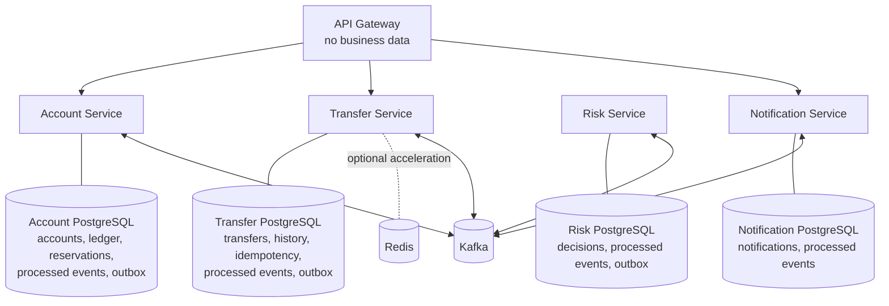
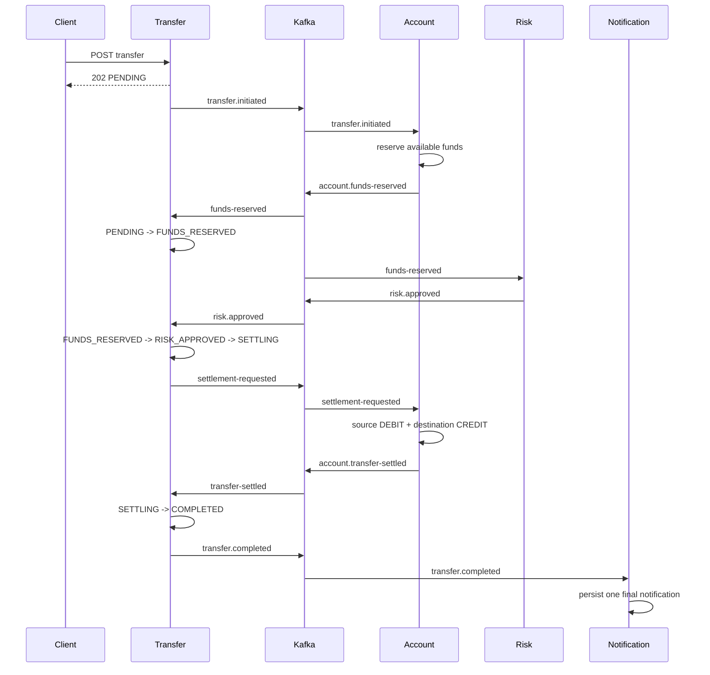
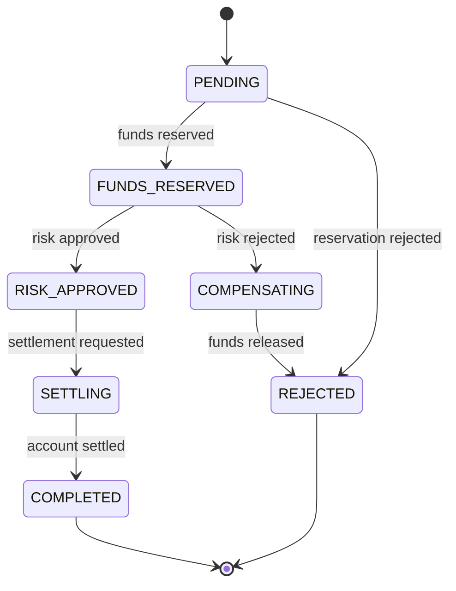

# System Design

LedgerFlow demonstrates durable, explainable money movement across independently
deployable services. Local ACID transactions protect each service boundary;
versioned Kafka messages connect those boundaries with eventual consistency.

## Ownership



No service reads another service's database. Redis is never a financial source of
truth. The API Gateway exposes Account, Transfer, and the demo Notification read
API; Risk Service and Actuator endpoints are not routed publicly.

## Happy path



Acceptance, reservation, approval, settling, and completion are distinct. A
`PENDING` response never claims that money moved.

## Risk rejection and compensation

```mermaid
sequenceDiagram
    participant Transfer
    participant Kafka
    participant Account
    participant Risk
    participant Notification
    Transfer->>Kafka: transfer.initiated
    Kafka->>Account: transfer.initiated
    Account->>Kafka: account.funds-reserved
    Kafka->>Risk: funds-reserved
    Risk->>Kafka: risk.rejected
    Kafka->>Transfer: risk.rejected
    Transfer->>Transfer: FUNDS_RESERVED -> COMPENSATING
    Transfer->>Kafka: compensation-requested
    Kafka->>Account: compensation-requested
    Account->>Account: reserved -= amount; available += amount
    Account->>Kafka: account.funds-released
    Kafka->>Transfer: funds-released
    Transfer->>Transfer: COMPENSATING -> REJECTED
    Transfer->>Kafka: transfer.rejected
    Kafka->>Notification: transfer.rejected
    Notification->>Notification: persist one rejection notification
```

No debit or credit ledger entry is created for compensation. A reservation
business rejection skips Risk Service and produces a terminal rejection event.

## Transfer state model



Every real transition appends immutable history. Consumers lock the transfer,
verify the expected state, and commit history, processed-event state, and any new
outbox row atomically. Valid stale events are ignored and recorded; illegal domain
transitions remain guarded.

## Consistency, recovery, and health

- Financial balances and ledger history change only inside Account PostgreSQL
  transactions.
- Transfer, Account, and Risk publish only through local transactional outboxes.
- Consumers assume at-least-once delivery and deduplicate durably.
- Outbox rows become `PUBLISHED` only after Kafka acknowledgment and remain
  retryable after broker failure or service restart.
- PostgreSQL and Kafka contribute to readiness for their owning services.
- Transfer Redis health is intentionally excluded from readiness; losing the cache
  degrades performance, not correctness.
- Expected business rejection is data, not an exception retry loop.

This phase does not provide distributed serializability, global Kafka ordering, or
instant cross-service consistency. It makes local commits recoverable and repeated
delivery harmless.

## Deliberate exclusions

Authentication, authorization, frontend, real notifications, external banking
integrations, production Kafka topology, multi-region deployment, and the Elastic
Stack remain outside Phase 3.
