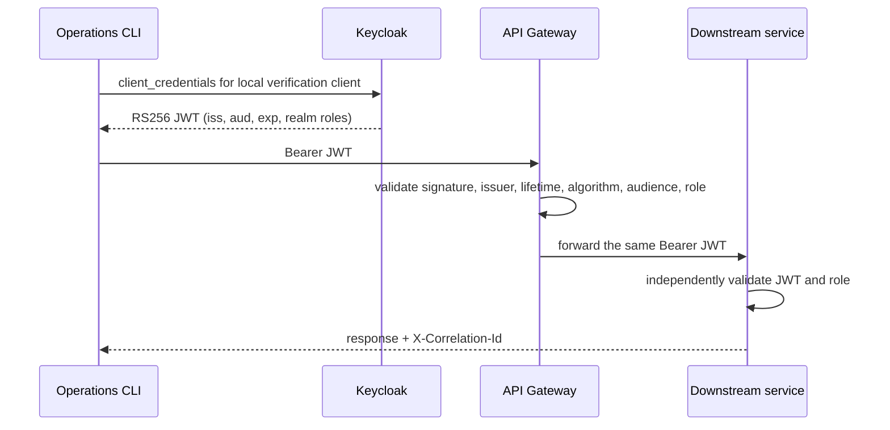

# Authentication and authorization

LedgerFlow protects an internal operations API. It does not implement customer
account ownership or retail-banking authorization.

## Local OIDC architecture



Keycloak imports `infra/keycloak/ledgerflow-realm.json`. The realm contains
`ledgerflow-operator`, `ledgerflow-auditor`, and `ledgerflow-admin`. The
`ledgerflow-api` audience is added by a dedicated protocol mapper. A
self-contained `ledgerflow-roles` client scope maps realm roles into access
tokens, avoiding dependence on Keycloak installation-specific built-in scope
identifiers during realm import.

`ledgerflow-spa` is a public future client with Authorization Code plus PKCE,
one local callback URI, no secret, no implicit flow, and no direct grants. No
frontend exists yet.

`ledgerflow-ops-cli`, `ledgerflow-operator-cli`, and
`ledgerflow-auditor-cli` are confidential service-account clients for bounded
local verification. They are not a production user-login design. Resource Owner
Password Credentials is disabled.

## Obtain a local token

After `docker compose up -d keycloak` is healthy:

```powershell
$tokenResponse = Invoke-RestMethod `
  -Method Post `
  -Uri "http://localhost:8090/realms/ledgerflow/protocol/openid-connect/token" `
  -ContentType "application/x-www-form-urlencoded" `
  -Body @{
    grant_type = "client_credentials"
    client_id = "ledgerflow-ops-cli"
    client_secret = $env:LEDGERFLOW_OPS_CLI_SECRET
  }
$token = $tokenResponse.access_token
```

Use the operator or auditor client and its corresponding environment secret to
verify role boundaries.

## Authorization matrix

| Operation | Operator | Auditor | Admin |
| --- | --- | --- | --- |
| Create account | allow | deny | allow |
| Read account and ledger | allow | allow | allow |
| Create transfer | allow | deny | allow |
| Read transfer and history | allow | allow | allow |
| Read notification | allow | allow | allow |
| Synthetic funding in `local`/`test` | deny | deny | allow |
| Metrics, info | deny | deny | allow |
| Liveness and readiness | public | public | public |

Risk Service has no public business route. Its probes are public and its
operational Actuator endpoints require admin.

## JWT and API behavior

Every resource server validates the RS256 signature, configured issuer,
`exp`, `nbf`, and the `ledgerflow-api` audience. Unknown algorithms and
missing roles fail closed. Gateway validation is not trusted as a substitute
for downstream validation.

Sessions are disabled. CSRF is disabled because these APIs authenticate every
request with an Authorization bearer header and do not use ambient browser
cookies. CORS is enforced only at the gateway.

Missing or invalid authentication returns a safe `401`; insufficient authority
returns `403`. No identity is accepted from `X-User-*`,
`X-Authenticated-User`, or `X-Forwarded-User`.

## Rate limiting and CORS

Redis rate-limit keys are derived from authenticated subject/client identity
with a bounded remote-address fallback. They use a
`gateway-rate-limit:*` namespace and never use transfer, account, idempotency,
or correlation identifiers. Reads, account creation, funding, and transfer
creation have separate configurable policies.

Protected writes fail closed when Redis cannot evaluate the rate limit. Redis
remains non-authoritative and Transfer Service financial correctness is
independent of it. Backend evaluation failures increment
`gateway.rate.limit.backend.failures`.

Allowed origins come from `GATEWAY_CORS_ALLOWED_ORIGINS`; the local default is
only `http://localhost:5173`. Credentials are disabled. Allowed methods and
headers are explicit, and preflight results are cached for one hour.
