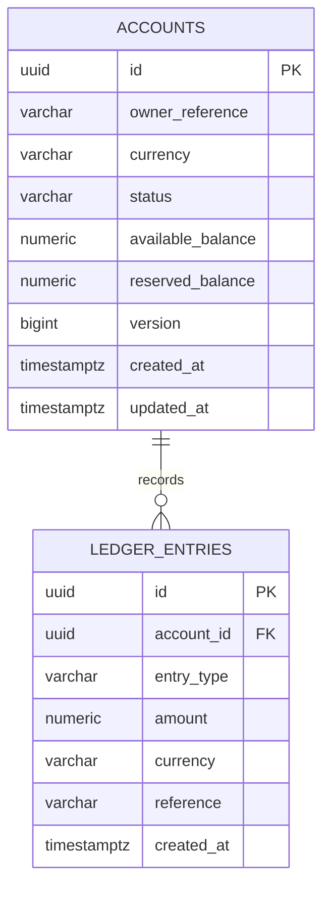

# Account Service

## Responsibility and boundary

The Account Service owns LedgerFlow accounts, their materialized balances, and their immutable ledger history. It currently supports account creation, account and ledger reads, reconciliation, and synthetic local/test credits. Each account has one centrally supported currency: EUR, USD, or GBP.

This is an educational service and does not connect to a payment network. Transfers, reservations, real funding, authentication, events, and external customer data are deliberately absent.

## Design

The module uses ports and adapters:

- `domain` contains framework-free account, money, ledger, invariant, reconciliation, and repository-port types;
- `application` owns transaction boundaries and coordinates domain operations through ports;
- `adapter.in.web` maps versioned HTTP DTOs and RFC 9457-compatible errors;
- `adapter.out.persistence` maps domain objects to package-private JPA entities and Spring Data repositories.

Money uses `BigDecimal` with a deterministic scale of two and precision of 19. JSON monetary values are strings. JPA entities never leave the persistence adapter.

## Database model

Flyway migration `V1__create_account_ledger.sql` creates the schema. Hibernate runs with `ddl-auto: validate`; it never creates or updates tables.



Both balance and ledger amount columns are `NUMERIC(19,2)`. Check constraints protect supported currencies, statuses, non-negative balances, positive ledger amounts, nonblank references, and non-negative versions. `(account_id, reference)` is unique. Ledger reads use an index on `(account_id, created_at DESC, id DESC)` for newest-first order with a stable UUID tie-breaker.

The application exposes no ledger update or delete operation. Entries are append-only from the application perspective.

## Funding transaction and concurrency

Synthetic funding executes in one Spring transaction:

1. load the account with PostgreSQL `SELECT ... FOR UPDATE` through JPA pessimistic write locking;
2. require an active account and validate a positive, two-decimal amount;
3. reject a reference already used by the account;
4. insert one credit ledger entry;
5. update available balance while preserving reserved balance;
6. commit both writes together.

The row lock serializes balance-changing commands per account and prevents lost updates. The JPA `@Version`/database `version` column is an additional safety and audit signal; no unbounded retry loop is used. The database unique constraint remains the final duplicate-reference defense for races.

Reconciliation calculates signed credits minus debits and compares that result with `available balance + reserved balance`. A mismatch is returned as an explicit result and logged with stable identifiers; the domain verifier can also raise a typed reconciliation failure.

## HTTP API

The source-of-truth contract is [`contracts/openapi/account-service.yaml`](../../contracts/openapi/account-service.yaml).

| Method and path | Result |
| --- | --- |
| `POST /api/v1/accounts` | Create an active zero-balance account; returns `201` and `Location` |
| `GET /api/v1/accounts/{accountId}` | Read current account state |
| `GET /api/v1/accounts/{accountId}/ledger?page=0&size=20` | Read newest-first ledger page; size is limited to 100 |
| `POST /api/v1/accounts/{accountId}/test-funding` | Add a synthetic credit; only present in `local` and `test` profiles |

Example:

```bash
curl -i -X POST http://localhost:8081/api/v1/accounts \
  -H "Content-Type: application/json" \
  -d '{"ownerReference":"customer-001","currency":"EUR"}'

curl http://localhost:8081/api/v1/accounts/ACCOUNT_ID

curl -i -X POST http://localhost:8081/api/v1/accounts/ACCOUNT_ID/test-funding \
  -H "Content-Type: application/json" \
  -d '{"amount":"1000.00","reference":"initial-funding-001"}'

curl "http://localhost:8081/api/v1/accounts/ACCOUNT_ID/ledger?page=0&size=20"
```

Validation failures and malformed identifiers return `400`; missing accounts return `404`; duplicate funding references and invalid account state return `409`; unsupported currencies return `422`. Responses use `application/problem+json` without database details or stack traces.

## Local PostgreSQL

Docker Desktop or a compatible Docker Engine is required. From the repository root:

```bash
cp .env.example .env
docker compose up -d postgres
docker compose ps
./mvnw -pl services/account-service spring-boot:run -Dspring-boot.run.profiles=local
```

On Windows PowerShell, copy `.env.example` to `.env` and replace `./mvnw` with `.\mvnw.cmd`. The service uses safe matching defaults when `.env` is not copied. Readiness, including the database contributor, is available at `http://localhost:8081/actuator/health/readiness`.

Stop the service with `Ctrl+C`, then stop PostgreSQL while retaining its named volume:

```bash
docker compose down
```

`docker compose down -v` also deletes local account data and should be used only when a clean database is intended.

## Test strategy

- plain unit tests cover money, account mutation, reconciliation, and application orchestration/failure paths;
- ArchUnit prevents domain dependencies on Spring, JPA, servlet, application, or adapter packages;
- Testcontainers runs PostgreSQL 18.4 for Flyway/JPA validation, database constraints, unique references, atomic rollback, persistence, ordering, pagination, reconciliation, and concurrent credits;
- MockMvc uses the same PostgreSQL container and the `test` profile for endpoint, validation, profile-gated funding, conflict, and ProblemDetail behavior.

Integration tests do not use H2 and do not silently skip when Docker is unavailable.

## Deferred deliberately

Transfer debits, reservations, Kafka/outbox behavior, Redis, security, real payment integrations, risk processing, notifications, and the React console remain future roadmap phases. The debit enum exists so reconciliation has the correct signed model, but no debit API or use case is implemented yet.
