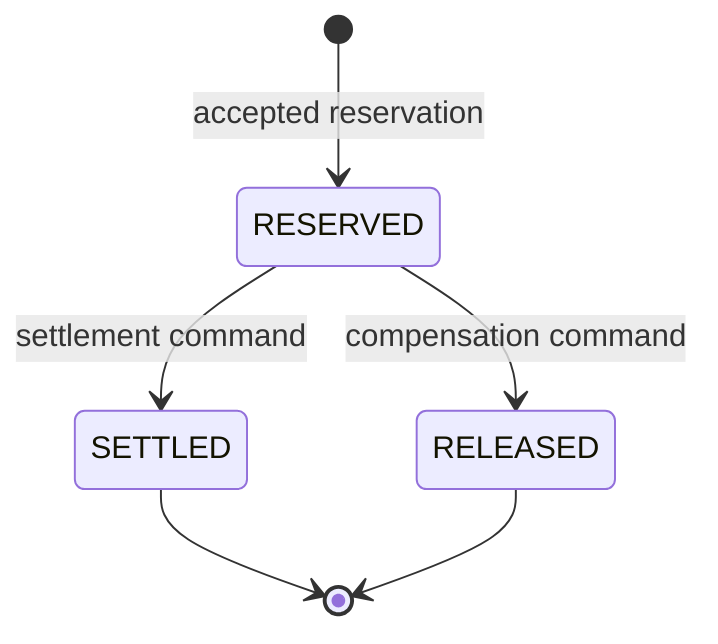

# Account Service

Account Service is the sole owner of accounts, available and reserved balances,
immutable financial ledger entries, and transfer reservations. Its framework-free
domain is coordinated through application ports and persistence/Kafka adapters.

## Reservation and money rules



A settled reservation cannot be released and a released reservation cannot be
settled. Typed domain exceptions guard both rules.

| Operation | Available | Reserved | Ledger |
| --- | --- | --- | --- |
| Reserve | `source -= amount` | `source += amount` | none |
| Settle source | unchanged | `source -= amount` | deterministic `DEBIT` |
| Settle destination | `destination += amount` | unchanged | deterministic `CREDIT` |
| Release | `source += amount` | `source -= amount` | none |

Settlement locks source and destination accounts in ascending UUID order. The
reservation, both balances, both ledger rows, processed event, and result outbox
event commit in one PostgreSQL transaction. Ledger references are unique:
`transfer:{transferId}:debit` and `transfer:{transferId}:credit`. Redelivery cannot
move money or append ledger twice.

## Reservation validation

`ledgerflow.transfer.initiated.v1` is rejected as a normal workflow outcome when:

- source or destination does not exist;
- either account is inactive;
- currencies differ from the transfer;
- source and destination are equal;
- available funds are insufficient.

Stable reasons are `SOURCE_ACCOUNT_NOT_FOUND`,
`DESTINATION_ACCOUNT_NOT_FOUND`, `SOURCE_ACCOUNT_INACTIVE`,
`DESTINATION_ACCOUNT_INACTIVE`, `CURRENCY_MISMATCH`,
`INVALID_ACCOUNT_PAIR`, and `INSUFFICIENT_FUNDS`.

## Kafka responsibilities

Account consumes `ledgerflow.transfer.commands.v1` and dispatches only the known
version-1 commands:

- `ledgerflow.transfer.initiated.v1`;
- `ledgerflow.transfer.settlement-requested.v1`;
- `ledgerflow.transfer.compensation-requested.v1`.

Its transactional outbox publishes these outcomes to
`ledgerflow.account.events.v1`:

- `ledgerflow.account.funds-reserved.v1`;
- `ledgerflow.account.funds-reservation-rejected.v1`;
- `ledgerflow.account.transfer-settled.v1`;
- `ledgerflow.account.funds-released.v1`.

The transfer UUID is the record key. Processed-event state, account/reservation
changes, ledger rows, and the outbound event are atomic. Technical failures use
bounded retry/backoff; malformed or unsupported records reach
`ledgerflow.transfer.commands.dlt.v1`.

## Persistence

`V1__create_account_ledger.sql` owns accounts and immutable ledger entries.
`V2__add_transfer_workflow.sql` adds:

- `transfer_reservations`, unique by transfer ID, with positive-amount, currency,
  account-pair, status, version, and foreign-key constraints;
- `processed_events`, unique by event ID;
- `outbox_events`, including status, attempt count, publication time, and
  deterministic polling indexes.

Hibernate uses `ddl-auto: validate`. PostgreSQL is authoritative and JPA entities
never leave the adapter.

## HTTP and local use

The [OpenAPI contract](../../contracts/openapi/account-service.yaml) covers account
create/read, ledger reads, and local/test synthetic funding. Funding is not a
production banking integration and is available only in `local` and `test`
profiles.

```powershell
docker compose up -d postgres kafka kafka-init
.\mvnw.cmd -pl services/account-service spring-boot:run "-Dspring-boot.run.profiles=local"
```

Readiness at `/actuator/health/readiness` includes PostgreSQL and Kafka.

## Verification

Unit and PostgreSQL Testcontainers tests cover reservation transitions, business
rejections, duplicate events, settlement, release, ledger uniqueness,
reconciliation, transaction rollback, constraints, Flyway/JPA validation, and the
original account API. The full Kafka workflow test additionally proves completed
and compensated flows against real Kafka, four PostgreSQL databases, and Redis.
