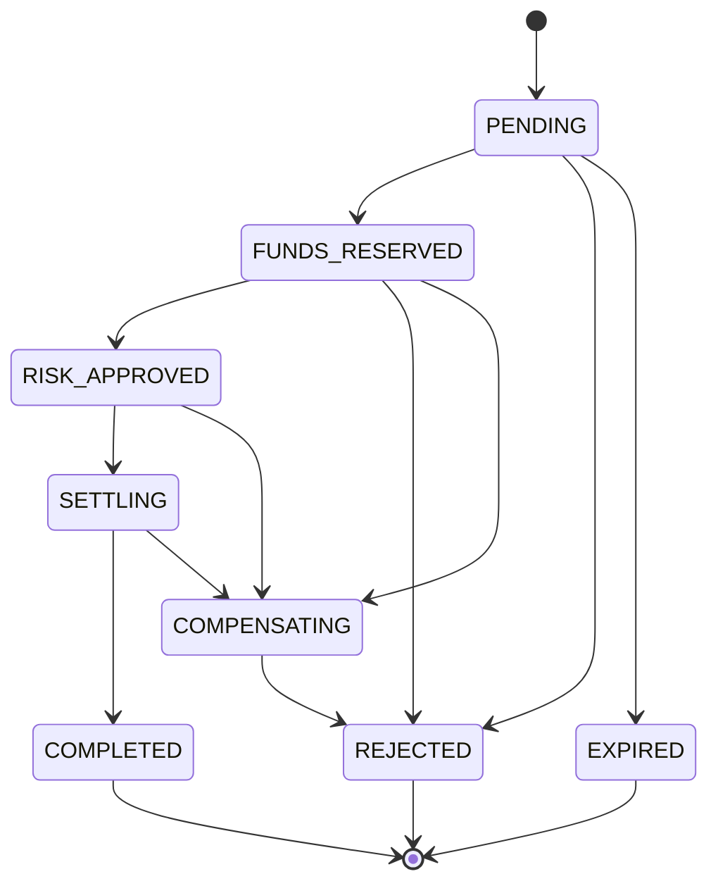
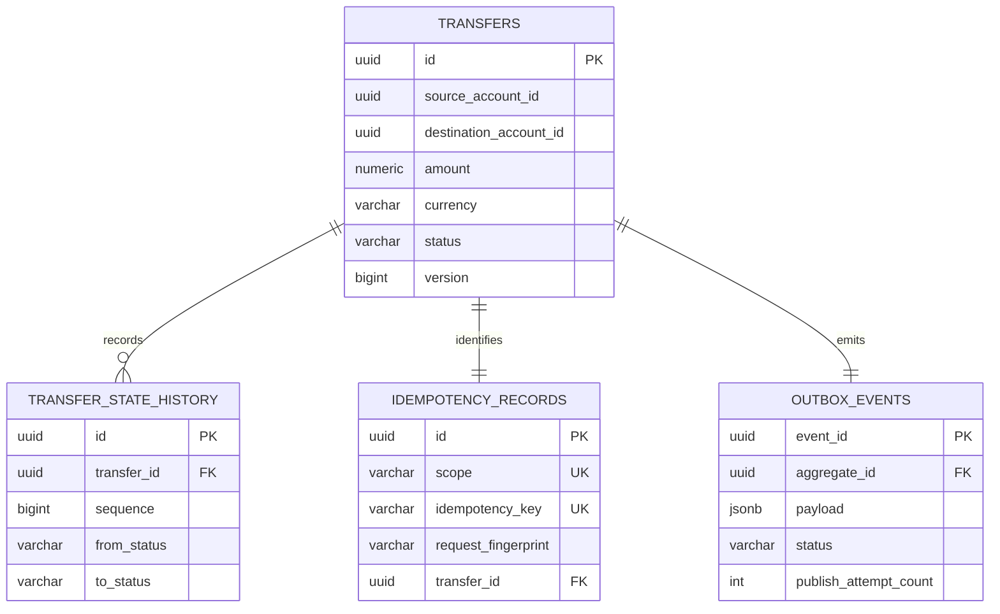
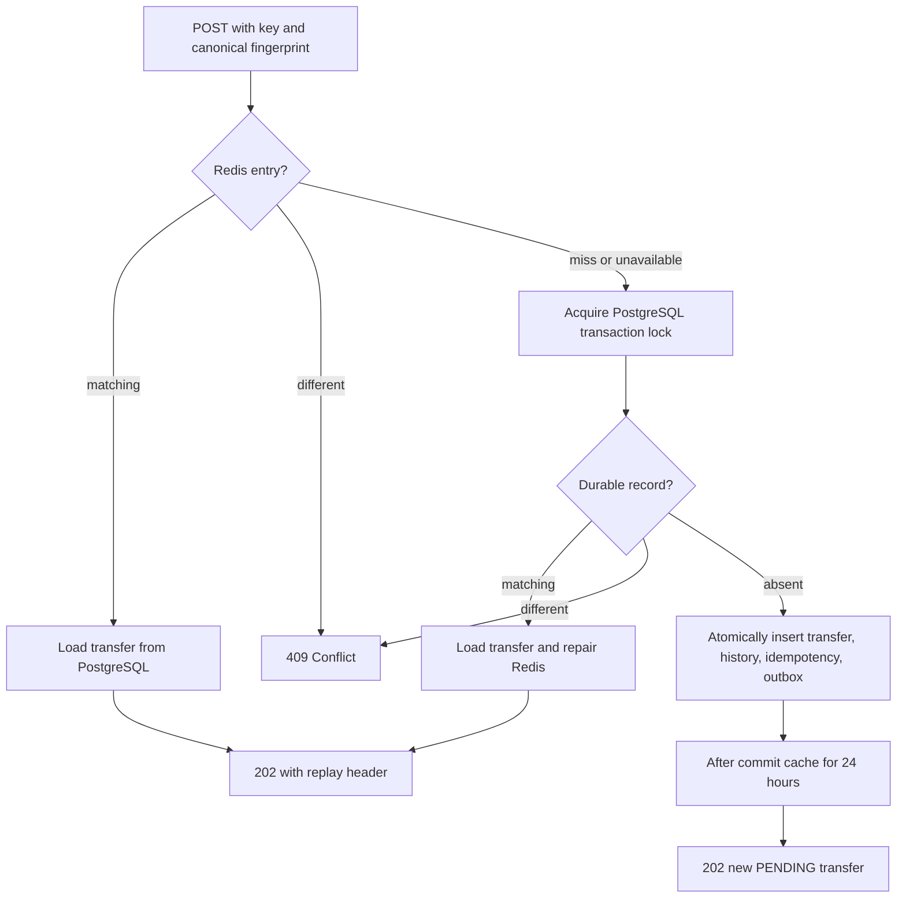

# Transfer Service

## Current responsibility

Transfer Service accepts and retrieves idempotent transfer workflow requests. Acceptance means that PostgreSQL durably contains the request and its event intent; it does **not** mean either account exists, funds are available, money is reserved, or settlement occurred. Every Phase 2 transfer remains `PENDING`. Kafka publication, Account Service interaction, risk, settlement, and compensation execution begin in Phase 3.

The domain defines its own `Transfer`, typed identifiers, `Money`, supported currency, reference, correlation and idempotency values, state transition, and initiated-event concepts. It imports no Account Service domain code.

## State machine

Repeated notification of the current state is rejected as a conflict. Every real transition increments the version, updates the timestamp, and creates immutable history. Terminal states have no outgoing transitions. Only creation in `PENDING` is exposed over HTTP.



## Atomic PostgreSQL model

Flyway owns the schema; Hibernate only validates it. One transaction writes the transfer, sequence-zero history, globally scoped creation-idempotency record, and one `ledgerflow.transfer.initiated.v1` outbox envelope. An exception from any write rolls back all four. The outbox row remains `PENDING`, with no publisher or Kafka dependency.



## Idempotency and concurrency

The request fingerprint is lowercase source/destination UUIDs, amount normalized to scale two, currency, and trimmed reference joined in a fixed order and hashed with SHA-256. JSON order, whitespace, correlation metadata, and `125.5` versus `125.50` do not change it.

Redis stores only `fingerprint:transfer-id` strings for 24 hours. A cache hit still loads authoritative transfer state from PostgreSQL. A miss checks PostgreSQL and repairs Redis. Any Redis runtime failure is logged without the raw key and degrades to PostgreSQL; Redis is excluded from readiness because safe acceptance remains possible without it.

PostgreSQL serializes concurrent requests for the same scope/key with a transaction-scoped advisory lock, then checks the durable record. The lock wait and Hikari connection acquisition are each bounded to five seconds; there are no application retries. The unique `(scope, idempotency_key)` constraint remains the final integrity defense. The current scope is global because authentication/client identity does not exist yet; the explicit `scope` column supports future principal scoping.



## API

```bash
curl -i http://localhost:8082/api/v1/transfers \
  -H "Content-Type: application/json" \
  -H "Idempotency-Key: transfer-request-001" \
  -H "X-Correlation-Id: example-correlation" \
  -d '{"sourceAccountId":"0d17936c-05d5-45ae-9ee8-0a33f7ae8256","destinationAccountId":"ae36fc23-a25d-40fb-a336-1a1604739880","amount":"125.50","currency":"EUR","reference":"invoice-2026-001"}'

curl http://localhost:8082/api/v1/transfers/{transferId}
curl http://localhost:8082/api/v1/transfers/{transferId}/history
```

The first request returns `202`, `Location`, and `X-Correlation-Id`. An equivalent replay returns the original transfer and `Idempotency-Replayed: true`; different logical content with the same key returns `409`. Semantic transfer validation returns `422`, malformed input or headers `400`, and unknown transfers `404`, all as safe RFC 9457 `ProblemDetail`.

## Local infrastructure and tests

Start the independent databases and cache:

```bash
docker compose up -d postgres transfer-postgres redis
./mvnw -pl services/transfer-service spring-boot:run -Dspring-boot.run.profiles=local
```

Transfer PostgreSQL defaults to port 5433 and Redis to 6379; `.env` overrides are documented in `.env.example`. PostgreSQL is in the readiness group; Redis is deliberately not.

Tests cover money and transfer invariants, the complete transition matrix, canonical fingerprints, architecture isolation, real PostgreSQL migrations and JSONB, REST headers/errors, replay/conflict/cache repair, TTL, and concurrent same-key acceptance. Testcontainers does not silently skip when Docker is unavailable.

## Deferred

There is no Kafka dependency, publisher, scheduler, Account Service call, account validation, reservation, risk decision, money movement, settlement, compensation execution, notification, authentication, or frontend code in this phase.
