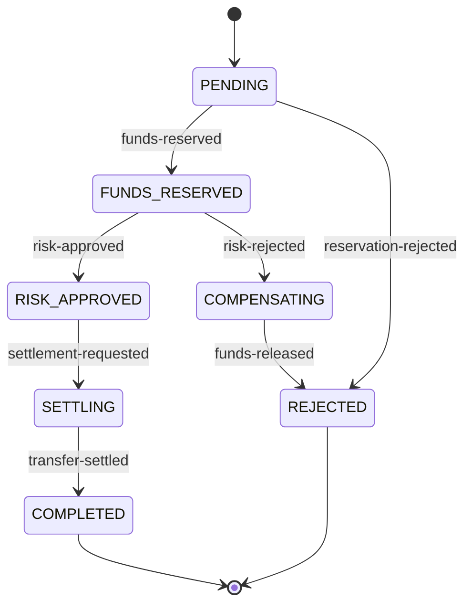

# Transfer Service

Transfer Service owns HTTP intake, durable request idempotency, transfer state,
immutable state history, workflow-event deduplication, and its transactional
outbox. It never reads Account or Risk databases and exposes no HTTP endpoint that
manually changes status.

## Intake

`POST /api/v1/transfers` atomically inserts:

- a `PENDING` transfer;
- sequence-zero history;
- a durable PostgreSQL idempotency record;
- a pending `ledgerflow.transfer.initiated.v1` outbox envelope.

The response is `202 Accepted`; it does not mean funds are reserved or moved.
Redis accelerates idempotency lookup but PostgreSQL remains authoritative. Redis
failure falls back safely and does not make readiness fail.

The [OpenAPI contract](../../contracts/openapi/transfer-service.yaml) also documents
transfer and history reads.

## Workflow state



Risk approval deliberately creates two immutable transitions in one transaction:
`FUNDS_RESERVED -> RISK_APPROVED -> SETTLING`, then emits
`ledgerflow.transfer.settlement-requested.v1`. Risk rejection moves to
`COMPENSATING`; only Account's funds-released confirmation makes the transfer
`REJECTED`.

Each consumer locks the transfer, verifies its expected state, writes history,
records the processed event, and creates any new outbox row atomically. Duplicate
event IDs return successfully. Valid stale events are recorded and ignored, so an
old approval cannot reopen a completed or rejected transfer.

## Kafka input and output

Transfer consumes account outcomes from `ledgerflow.account.events.v1` and risk
decisions from `ledgerflow.risk.events.v1`. Its outbox publishes initiated,
settlement, and compensation messages to `ledgerflow.transfer.commands.v1`, and
terminal completed/rejected messages to `ledgerflow.transfer.events.v1`.

Every record is keyed by transfer ID and uses the local version-1 envelope defined
by the [AsyncAPI contract](../../contracts/asyncapi/ledgerflow-events.yaml).
Malformed, unknown, or unsupported records follow bounded retries and their
topic-specific DLT. Expected duplicates and business rejection do not.

Outbox polling is oldest-first, bounded, and uses PostgreSQL
`FOR UPDATE SKIP LOCKED`. Rows become `PUBLISHED` only after Kafka acknowledges the
send. The same event ID is retained after failure.

## Persistence

`V1__create_transfer_intake.sql` owns transfers, history, durable idempotency, and
the outbox. `V2__add_workflow_event_processing.sql` adds `processed_events` and
workflow polling/lookup indexes. PostgreSQL JSONB retains the stable event
envelope; Hibernate validates rather than generates the schema.

## Local use and health

```powershell
docker compose up -d transfer-postgres redis kafka kafka-init
.\mvnw.cmd -pl services/transfer-service spring-boot:run
```

Readiness includes PostgreSQL and Kafka but deliberately excludes Redis.

All business routes independently validate Keycloak RS256 JWTs. Operator/admin can
create transfers; operator/auditor/admin can read state and history. Metrics and
info require admin, while liveness/readiness remain public. Gateway rate limiting
uses a separate Redis namespace and does not alter Transfer Service’s PostgreSQL
idempotency authority.

Prometheus exposes transfer acceptance, workflow completion/rejection, Kafka
listener/DLT, outbox backlog and publication, HTTP/JVM, and Hikari signals. The
`observability` profile writes ECS JSON with bounded correlation and workflow MDC.

## Verification

Domain and PostgreSQL tests cover every Phase 3 transition, immutable history,
duplicate and stale delivery, atomic outbox creation, terminal-state protection,
durable HTTP idempotency, Redis degradation, JSONB, and outbox ordering. A real
Kafka Testcontainer verifies initiated-event publication with the transfer key and
database publication acknowledgement. The cross-service E2E suite proves both
settlement and risk compensation.
